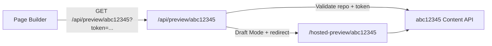

# Instant Start hosted preview overlay

Prismic-managed path-based hosted preview for Instant Start. The public starter keeps a clean `src/` tree; this directory holds deployment-only sources applied before Vercel builds the shared starter project.

## Architecture



1. Obelix provisions a Production preview URL such as `https://next-instant-start.vercel.app/api/preview/abc12345`.
2. Page Builder opens that URL with the normal Prismic preview ref token.
3. The preview route validates the repository label and preview token.
4. After enabling Draft Mode, the user is redirected to `/hosted-preview/abc12345`.
5. The hosted preview page fetches and renders that repository's content with `cache: "no-store"`.

The overlay also removes root-level `<PrismicPreview>` (which targets `prismic.config.json`'s repository) so tenant pages only mount one toolbar for the previewed repository. Hosted preview routes use `dynamic = "force-dynamic"` so Draft Mode is not baked into a static shell.

Canonical starter routes stay unchanged:

- `/api/preview` — local single-repository preview
- `/` — canonical homepage from `prismic.config.json`

## Files

| File | Purpose |
| --- | --- |
| `patched-src/src/` | **Single source of truth** — mirrors `src/`; add or edit only the files the deployment needs |
| `apply.sh` | Copies everything under `patched-src/src/` into `src/`, generates an ephemeral patch, then applies it |
| `verify-deployment.sh` | Asserts `src/` has no hosted preview runtime |

There is no committed `.patch` file. `apply.sh` derives the diff at build time.

## Vercel configuration

Set this on the **Prismic-managed** `next-instant-start` Vercel project only. Do not add it to user clones.

**Build Command**

```sh
./deployment/hosted-preview/apply.sh . && npm run build
```

Do **not** commit a project-level `vercel.json` with this build command. User clones should keep the default `npm run build`.

No custom DNS or environment variables are required for the path-based feasibility setup.

## Conflicts

A conflict happens when public `src/` changes on `main` but `patched-src/` still reflects the old base — for example, someone refactors `src/prismicio.ts` without updating `patched-src/src/prismicio.ts`.

At build time, `apply.sh`:

1. Copies every file under `patched-src/src/` into `src/`
2. Computes `git diff HEAD -- src/` against the clean starter tree
3. Runs `git apply --check` on that ephemeral patch
4. **Fails closed** if hunks do not apply cleanly
5. Applies the patch only when the check passes

There is no automatic merge. Conflicts are resolved by updating `patched-src/`.

## Rollback

1. Restore the default Vercel Build Command: `npm run build`.
2. Redeploy the starter. Existing repositories keep their configured preview URLs until changed manually.

## Local development

```sh
# Verify the public starter stays clean
./deployment/hosted-preview/verify-deployment.sh

# Apply the overlay locally (mutates src/)
./deployment/hosted-preview/apply.sh .
```

After applying locally, reset with:

```sh
git checkout HEAD -- src/ && git clean -fd src/
```

## Handoff

When a user runs `prismic init --repo <name>` on a cloned starter, the CLI:

- Removes hosted preview URLs from the repository settings
- Deletes `deployment/hosted-preview/` from the local project
- Configures the local Development preview

## Updating hosted preview logic

1. Edit files under `patched-src/src/` only.
2. Run `./deployment/hosted-preview/verify-deployment.sh` locally or rely on the GitHub workflow.

No manual patch regeneration is required.
